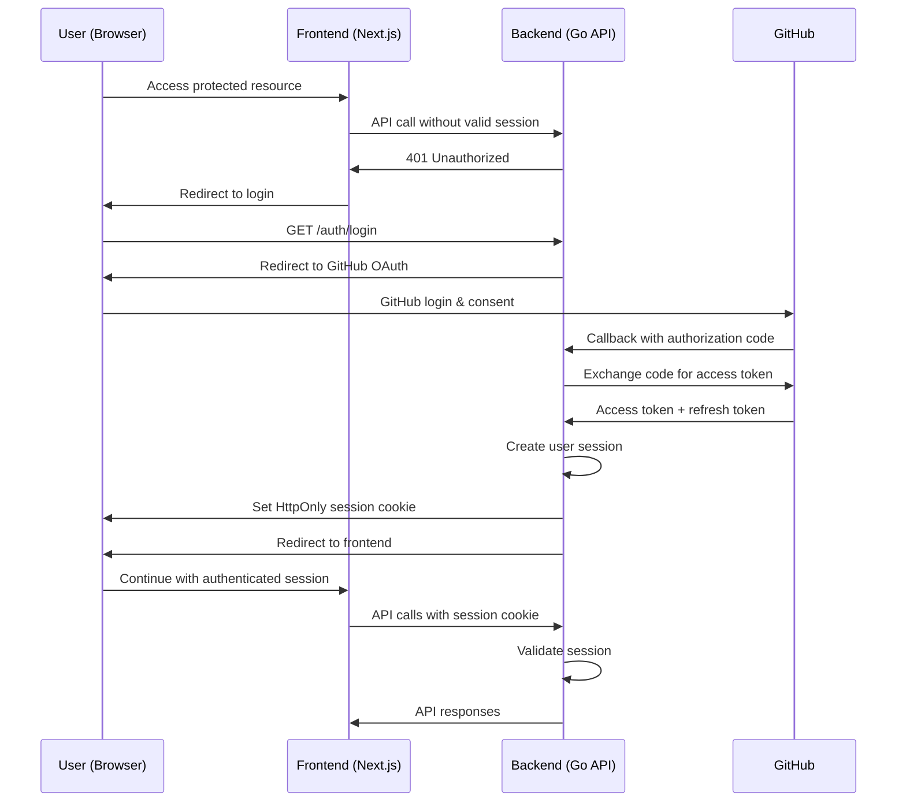

# ADR-001: GitHub OAuth Authentication

## Status
Proposed

## Context

### 現在の課題
tacokumoのAPIシステム（Admin API、Portal API）は現在、単純なAuthorizationヘッダーの検証のみを行っており、以下の問題が存在します：

1. **セキュリティギャップ**: フロントエンドに認証処理を委ねており、APIサーバー自体が公開される前提で設計されていない
2. **認証の未実装**: Bearer tokenを期待するものの、実際の検証ロジックが存在しない
3. **権限管理の不備**: GitHub上のチーム構成と連携した認可システムが未整備
4. **GitHub API連携**: バックエンドAPIでGitHub APIを活用したい

### 要件
- 最もセキュアな構成を実現
- バックエンドAPIで適宜GitHub APIを叩くことを許容
- APIサーバ自体が公開されることを想定（フロントエンドを信頼せず、すべて認証/認可に載せる）
- 既存のフロントエンド（Next.js）との互換性を保持
- GitHub Teamメンバーシップベースでの権限管理

## Decision

### 1. GitHub OAuth 2.0 Authorization Code Flowを採用

セキュリティを最優先とし、以下のOAuthフローを実装：



### 2. Redis ベースセッション管理

- **セッション保存**: Redisにセッションデータを保存
- **スケーラビリティ**: 水平スケーリングに対応
- **TTL管理**: 自動的なセッション期限切れ
- **高速アクセス**: メモリベースでの高速セッション検証

### 3. Bearer Token互換性

既存フロントエンドとの互換性を保つため：
- OAuth完了後にBearer tokenを生成
- フロントエンドは従来通り`Authorization: Bearer <token>`形式でAPIコール
- Bearer tokenは内部的にRedisセッションにマッピング
- Token形式: `<session_id>.<signature>`でセキュリティを確保

### 4. GitHub Team ベース認可

- **Team Membership**: GitHub Organizationのチームメンバーシップを取得
- **ロールマッピング**: チームを内部システムのロール（admin, developer, viewer）にマッピング
- **プロジェクトアクセス**: チームごとにアクセス可能なプロジェクトを定義
- **キャッシング**: セッション内にチーム情報をキャッシュしてAPI呼び出しを最小化

## Implementation Details

### 新規APIエンドポイント

#### 認証エンドポイント
1. `GET /v1alpha1/auth/login` - OAuth flow開始
2. `GET /v1alpha1/auth/callback` - GitHub OAuth コールバック処理
3. `POST /v1alpha1/auth/logout` - セッション無効化
4. `GET /v1alpha1/auth/me` - 現在のユーザー情報取得
5. `POST /v1alpha1/auth/refresh` - トークン更新

### データ構造

#### セッション情報
```go
type Session struct {
    ID              string            `json:"id"`
    UserID          string            `json:"user_id"`
    AccessToken     string            `json:"access_token"`
    RefreshToken    string            `json:"refresh_token"`
    ExpiresAt       time.Time         `json:"expires_at"`
    TeamMemberships []TeamMembership  `json:"team_memberships"`
    CreatedAt       time.Time         `json:"created_at"`
    UpdatedAt       time.Time         `json:"updated_at"`
}

type User struct {
    ID        string    `json:"id"`
    GitHubID  int64     `json:"github_id"`
    Username  string    `json:"username"`
    Email     string    `json:"email"`
    Name      string    `json:"name"`
    AvatarURL string    `json:"avatar_url"`
    CreatedAt time.Time `json:"created_at"`
    UpdatedAt time.Time `json:"updated_at"`
}

type TeamMembership struct {
    OrgName  string `json:"org_name"`
    TeamName string `json:"team_name"`
    Role     string `json:"role"` // member, maintainer
}
```

#### チーム-ロールマッピング
```go
type TeamRole struct {
    OrgName       string   `json:"org_name"`
    TeamName      string   `json:"team_name"`
    SystemRole    string   `json:"system_role"`    // admin, developer, viewer
    ProjectAccess []string `json:"project_access"` // accessible project IDs
}
```

### OpenAPI Security定義

両APIスペックに以下を追加：

```yaml
components:
  securitySchemes:
    BearerAuth:
      type: http
      scheme: bearer
      description: Bearer token obtained from OAuth flow
    CookieAuth:
      type: apiKey
      in: cookie
      name: session_id
      description: Session cookie for web applications

security:
  - BearerAuth: []
  - CookieAuth: []
```

### 環境設定

```env
# GitHub OAuth
GITHUB_CLIENT_ID=your_github_app_client_id
GITHUB_CLIENT_SECRET=your_github_app_client_secret
GITHUB_REDIRECT_URI=https://your-api.com/v1alpha1/auth/callback

# Session Management
SESSION_SECRET=your_session_secret_key
REDIS_URL=redis://localhost:6379
REDIS_SESSION_DB=0
SESSION_TTL=24h

# CORS
FRONTEND_URL=https://your-frontend.com
```

### GitHub OAuth App設定

既存のGitHub OAuth Appで以下を確認/設定：
- **Callback URL**: `https://your-api.com/v1alpha1/auth/callback`
- **Permissions**:
  - `user:email` - ユーザーのメールアドレス取得
  - `read:user` - ユーザープロフィール情報取得
  - `read:org` - Organization・チームメンバーシップ取得（必須）

## Implementation Priority

### Phase 1: ドキュメンテーション
- [x] ADR作成
- [ ] OpenAPI仕様更新（認証エンドポイント追加）
- [ ] OpenAPI仕様更新（セキュリティ定義追加）

### Phase 2: フロントエンド統合ガイド
- [ ] 認証フローの実装例
- [ ] エラーハンドリングパターン
- [ ] 状態管理ガイドライン

### Phase 3: バックエンド実装ガイド
- [ ] Go実装における詳細仕様
- [ ] Redis設定とセッション管理
- [ ] GitHub API統合パターン
- [ ] セキュリティベストプラクティス

## Frontend Integration Guide

### 認証状態の管理

```javascript
// 1. ユーザーがログインしていない場合
const redirectToLogin = () => {
  window.location.href = `${API_BASE_URL}/v1alpha1/auth/login?redirect_uri=${encodeURIComponent(window.location.href)}`;
};

// 2. 認証後のトークン取得
const getTokenFromCallback = async () => {
  // OAuth完了後、APIから Bearer token を受け取る
  const response = await fetch(`${API_BASE_URL}/v1alpha1/auth/me`, {
    credentials: 'include' // session cookie
  });
  const user = await response.json();
  return user.bearer_token; // APIがBearerトークンも返す
};

// 3. 既存のAPI呼び出しパターン（変更不要）
const callAPI = async (endpoint, options = {}) => {
  const token = localStorage.getItem('bearer_token');
  return fetch(`${API_BASE_URL}${endpoint}`, {
    ...options,
    headers: {
      'Authorization': `Bearer ${token}`,
      'Content-Type': 'application/json',
      ...options.headers
    }
  });
};
```

### エラーハンドリング

```javascript
const handleAuthError = (response) => {
  if (response.status === 401) {
    // セッション切れの場合、再ログインにリダイレクト
    localStorage.removeItem('bearer_token');
    redirectToLogin();
    return;
  }
  // その他のエラーハンドリング
};
```

## Security Considerations

### CSRF Protection
- OAuth state parameterによる CSRF 攻撃防止
- セッションごとにランダムなstate生成

### Session Security
- HttpOnly, Secure, SameSite cookie属性
- セッションローテーション
- 適切なTTL設定

### Token Security
- Bearer token の署名検証
- 短い有効期限と自動更新
- セッション無効化時のトークン無効化

### Rate Limiting
- GitHub API rate limit の管理
- 認証エンドポイントのrate limiting
- セッション作成の頻度制限

## Monitoring & Logging

### 監視項目
- OAuth認証成功/失敗率
- セッション作成/破棄数
- GitHub API呼び出し頻度
- チーム情報の更新頻度

### ログ出力
- 認証イベント（ログイン/ログアウト）
- 権限チェック結果
- GitHub API呼び出しエラー
- セキュリティ関連イベント

## Migration Strategy

### 段階的導入
1. 新認証システムのデプロイ
2. 既存セッション（存在する場合）の自然な期限切れ待ち
3. ユーザーのOAuth認証による新しいBearerトークン取得
4. 既存フロントエンドコードは変更不要で継続動作

### Rollback Plan
- 認証システムの無効化オプション
- 一時的な認証バイパス（開発環境）
- ログレベルの調整による詳細な問題調査

## Consequences

### Positive
- **セキュリティ向上**: 真のゼロトラストアーキテクチャ実現
- **GitHub統合**: チーム情報との自動連携による運用効率化
- **スケーラビリティ**: Redisベースの水平スケーリング対応
- **既存互換性**: フロントエンドの変更を最小限に抑制
- **監査性**: 包括的な認証・認可ログ

### Negative
- **複雑性増加**: 認証レイヤーの実装・運用複雑性
- **外部依存**: GitHub・Redis への依存性
- **レイテンシ**: 追加の認証検証処理
- **運用コスト**: Redis インフラと監視コスト

### Risks
- **GitHub API Limitation**: Rate limit による制約
- **Single Point of Failure**: Redisの可用性への依存
- **Team Structure Change**: GitHub team構成変更時の権限への影響

### Mitigation
- GitHub API のキャッシング戦略
- Redis cluster による高可用性
- Team mapping の柔軟な設定とホットリロード機能